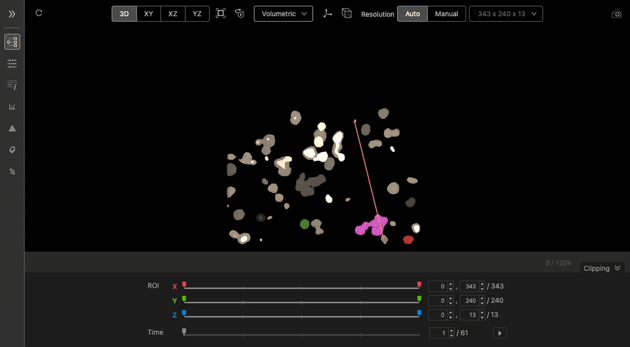
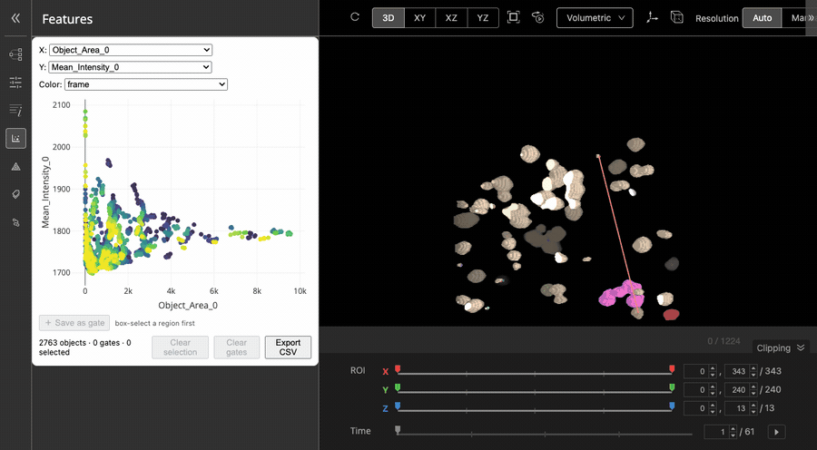
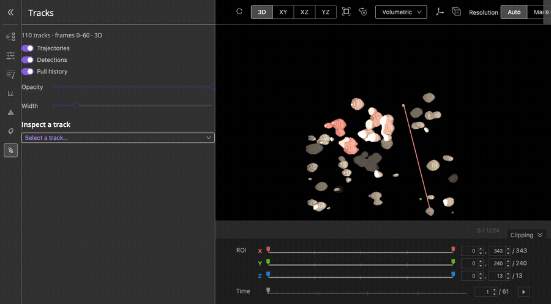

# Interactive Zarr Explorer

A Zarr viewer built on [Vol-E](https://github.com/allen-cell-animated/vole-app)
(Allen Institute for Cell Science), for interactive exploration of local
OME-Zarr `.zip` files.

## What it can do

| Feature | |
|---|---|
| **Local `.zip` loading** | open an `.ome.zarr.zip` in place, read lazily per chunk |
| **Multi-zip loading** | several files at once, as separate **scenes** or as **overlaid** channels |
| **Feature scatter** | X / Y / colour-by, selection, gates, CSV export |
| **Correlation heatmap and annotations** | over the same measurement table |
| **NGFF `labels/` support** | a segmentation group loads as an extra channel |
| **3D linked to the scatter** | both ways: pick in the volume or in the plot |
| **Tracking overlay** | trajectories and detections, with per-track statistics |

## In use

Segmented objects in 3D:



Picking objects in the volume highlights them in the scatter, and the selection
survives a change of view mode:



Tracking trajectories accumulating over time:



## Repo structure

```
/
├── pixi.toml                         ← pins Node.js, defines all tasks
├── vole-core/                        ← WebGL engine + Zarr/ZIP loaders
│   └── src/loaders/
│       ├── OmeZarrLoader.ts              ← multiscale loader entry
│       └── zarr_utils/ZipStore.ts        ← lazy per-chunk ZIP store
└── vole-app/                         ← React app (consumes vole-core via file:../)
    └── src/aics-image-viewer/
        ├── components/
        │   ├── App/index.tsx             ← viewer root, scenes + panels
        │   ├── useVolume.ts              ← volume lifecycle, per-scene loading
        │   ├── ScatterPanel.tsx          ← scatter + gating + CSV
        │   ├── CorrelationPanel.tsx      ← correlation heatmap
        │   ├── AnnotationPanel.tsx       ← manual label tagging
        │   └── TracksPanel.tsx           ← tracking controls + statistics
        ├── shared/utils/
        │   ├── sceneStore.ts             ← one SceneStore per dataset, N scenes
        │   ├── loadMeasurements.ts       ← reads tables/measurements (AnnData)
        │   └── objectKey.ts              ← (frame, label_id) selection key
        └── state/
            ├── store.ts                  ← Zustand store root
            └── selection.ts              ← measurements, gates, selection, labels
```

## Installation

Requires [pixi](https://pixi.sh), which provides the pinned Node.js.

```bash
pixi run setup   # install dependencies and build the engine
pixi run dev     # dev server at http://localhost:9020
```

After editing `vole-core/src`, run `pixi run rebuild-core` — the app consumes the
**built** `vole-core/es`, not its source. After switching branches, clean first:

```bash
cd vole-core && npm run clean && cd .. && pixi run build-core
```

`build` overwrites what it compiles and deletes nothing, so a branch missing a
module leaves the other branch's copy behind in `es/`. The result compiles, runs,
and behaves like neither.

## Loading data

- **Load .zip** — one or more local `.ome.zarr.zip` files.
- **Load URL** — a remote OME-Zarr over `https://`, `s3://` or `gs://`.

With several files, choose **separate scenes** (each keeps its own channel
settings) or **overlay channels** (requires identical pixel dimensions).

### Preparing a `.zip`

Package the `.ome.zarr` folder **uncompressed** (`ZIP_STORED`). Zarr chunks are
already compressed, so zip deflate only forces a wasted inflate on every read —
this is also what [RFC-9](https://github.com/ome/ngff/pull/544) recommends for
zipped OME-Zarr.

```python
import zipfile, os

src = "image.ome.zarr"
with zipfile.ZipFile("image.ome.zarr.zip", "w", zipfile.ZIP_STORED) as zf:
    for dp, _, files in os.walk(src):
        for f in files:
            full = os.path.join(dp, f)
            arc = os.path.relpath(full, os.path.dirname(src)).replace(os.sep, "/")
            zf.write(full, arc)
```

## Using it in your own app

**Engine only** — point the loader at one or more zip `Blob`s:

```ts
import { OmeZarrLoader, VolumeFileFormat } from "@aics/vole-core";

const loader = await context.createLoader("local.zip", {
  fileType: VolumeFileFormat.ZARR,
  zipSources: [{ data: zipBlob }], // rootPath auto-detected
});
```

**Full viewer** — mount the `App` component directly:

```tsx
import { App } from "vole-app";

<App zipData={myZipBlob} /> // Blob | Blob[] | { scenes: (Blob | Blob[])[] }
```

## Useful pixi tasks

`setup` · `dev` · `build-core` / `rebuild-core` · `typecheck` · `lint` · `test` ·
`check` (everything CI runs, in order)

## Notes

- On Zarr v3, measurement-table ids load but feature columns don't yet (zarrita
  doesn't decode AnnData's string-array column names). Images are unaffected;
  tables produced today are v2.
- Standalone forks kept as snapshots:
  [vole-app](https://github.com/assadiab/vole-app),
  [vole-core](https://github.com/assadiab/vole-core) — this monorepo is the
  source of truth.
- Licensed BSD-3-Clause; original Allen Institute copyright/license retained in
  each sub-project.
